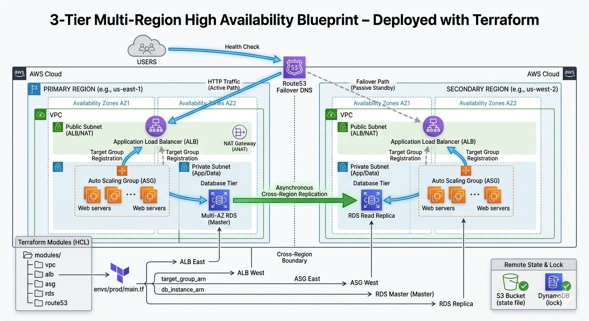

# Building a 3-Tier Multi-Region High Availability Architecture with Terraform
In the world of high-stakes infrastructure, "High Availability" in a single region is often just a single point of failure away from a disaster. True resilience requires thinking globally. For Day 27 of my Terraform challenge, I moved beyond Availability Zones to build a **Multi-Region Disaster Recovery (DR)** architecture.

---

## 1. The Project Structure: Five Modules, One Goal

I structured this project using five distinct modules: `vpc`, `alb`, `asg`, `rds`, and `route53`. 

**Why not one giant module?**
In a 3-tier architecture, each layer has a different lifecycle. Network stacks change rarely, while application tiers scale daily. By separating them, I can update the Auto Scaling logic without touching the database or the core networking. This "separation of concerns" is what makes Terraform code maintainable at scale.

---

## 2. The Data Flow: Orchestrating the "Handshake"

The magic of this architecture lies in how data flows between these modules across different AWS regions.

* **Primary Compute Loop:** In `us-east-1`, the `alb_primary` module outputs a `target_group_arn`. This is fed directly into `asg_primary`. This ensures that every EC2 instance launched by the Auto Scaling Group knows exactly which Load Balancer it belongs to.
* **The Global Database Glue:** The most critical link is the `rds_primary.db_instance_arn`. This ARN is passed across regional boundaries into the `rds_replica` module as the `replicate_source_db`. This tells AWS to start an asynchronous data stream from the East Coast to the West Coast.

---

## 3. Visualizing Health: The Route53 Control Plane

The brain of this operation is Route53. I configured two Health Checks that "poll" the ALB endpoints every 30 seconds.

**In the Route53 Console:**
* **Primary Health Check:** ✅ Green (Healthy)
* **Secondary Health Check:** ✅ Green (Healthy)

As long as both are green, Route53 follows my **Primary Failover Policy**, sending 100% of the traffic to `us-east-1`.

---

## 4. The Anatomy of a Failover

What happens if `us-east-1` goes offline? Here is the chain reaction:

1.  **Detection:** The Route53 health check fails three consecutive times.
2.  **State Change:** The Primary record is marked as "Unhealthy."
3.  **DNS TTL Expiry:** As the Time-to-Live (TTL) on existing DNS records expires (usually 60 seconds), client browsers re-query Route53.
4.  **The Shift:** Route53 sees the Primary is down and immediately responds with the Alias record for the `us-west-2` Load Balancer.
5.  **Recovery:** Traffic begins flowing to the secondary region. While the database is in "read-only" mode (as a replica), the application remains accessible to users.

---

## 5. Multi-AZ vs. Cross-Region: Knowing the Difference

It’s easy to confuse these two, but they serve very different purposes:

* **Multi-AZ:** This is a **Regional** feature. It keeps a standby copy of your database in a different Availability Zone (e.g., `us-east-1a` to `us-east-1b`). It protects you if a single data center loses power, but it won't help if the entire `us-east-1` region has a backbone network failure.
* **Cross-Region Read Replica:** This is a **Global** feature. It sends data thousands of miles away to a completely different geographic area. This is your insurance policy against a "black swan" event that takes down an entire AWS region.

---

### Final Thoughts
Today's project was about more than just writing code; it was about designing for the worst-case scenario. With Terraform, we don't just hope for the best—we script the recovery.
