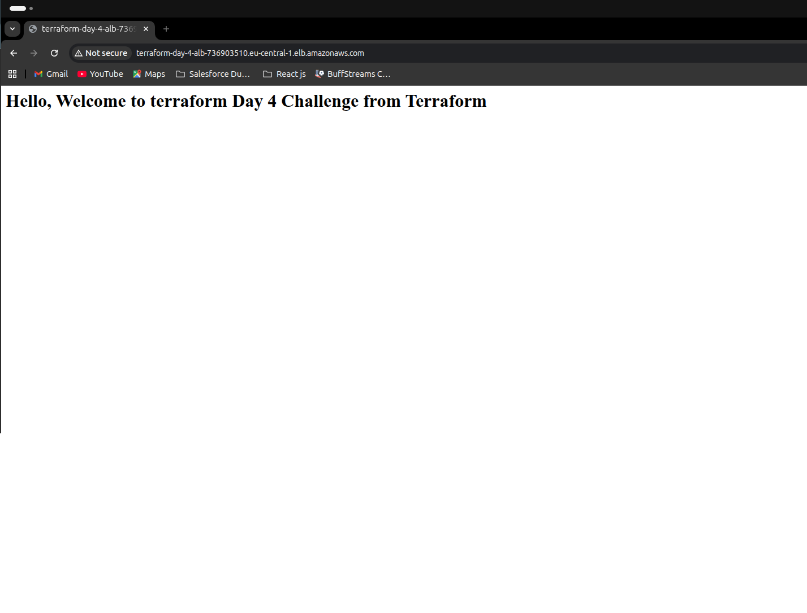

# 🚀 Deploying a Highly Available Web App on AWS Using Terraform
## 📌 Introduction

In this lab, I deployed a **highly available clustered web server architecture** using Terraform. Unlike a single-instance setup, this design uses an Auto Scaling Group (ASG) and Application Load Balancer (ALB) to ensure scalability, fault tolerance, and reliability.

---

## 🧱 Clustered Web Server Code Overview

### 🔹 Key Components

#### 1. Provider Configuration

The deployment uses AWS as the cloud provider, with the region defined using variables for flexibility.

---

#### 2. Data Sources

I used Terraform data sources to dynamically fetch existing infrastructure:

```hcl
data "aws_vpc" "default" {
  default = true
}

data "aws_subnets" "default" {
  filter {
    name   = "vpc-id"
    values = [data.aws_vpc.default.id]
  }
}
```

✅ This avoids hardcoding values like VPC IDs.

---

#### 3. Security Groups

* **Instance Security Group**

  * Allows HTTP traffic on port 80
* **ALB Security Group**

  * Allows inbound HTTP from anywhere

---

#### 4. Launch Template

Defines how EC2 instances are created:

```bash
#!/bin/bash
apt update -y
apt install apache2 -y
echo "<h1>Hello, Welcome to Terraform Day 4 Challenge</h1>" > /var/www/html/index.html
systemctl start apache2
systemctl enable apache2
```

✅ Ensures all instances are identical.

---

#### 5. Auto Scaling Group (ASG)

* Min: 2 instances
* Max: 5 instances
* Spans multiple subnets

✅ Provides:

* Auto-healing
* Auto-scaling
* High availability

---

#### 6. Application Load Balancer (ALB)

* Distributes incoming traffic
* Attached to multiple subnets
* Uses a listener on port 80

---

#### 7. Target Group

* Routes traffic to EC2 instances
* Performs health checks:

```hcl
health_check {
  path = "/"
}
```

---

#### 🔗 Architecture Flow

```
User → ALB → Listener → Target Group → ASG → EC2 Instances
```

---

## ✅ Deployment Confirmation

After running:

```bash
terraform apply
```

Terraform returned:

```bash
alb_dns_name = terraform-day-4-alb-2100779818.eu-central-1.elb.amazonaws.com/
```

When I opened the DNS in a browser, I saw:

```
Hello, Welcome to Terraform Day 4 Challenge
```


✅ This confirms:

* Load balancer is working
* Instances are healthy
* Traffic is properly routed

---

## 🔁 DRY Principle in Practice

### What is DRY?

**DRY (Don’t Repeat Yourself)** means avoiding duplication by reusing code and variables.

---

### How I Applied It

Instead of hardcoding values:

```hcl
port = 80
```

I used variables:

```hcl
port = var.server_port
```

---

### Why This Matters

Without DRY:

* Changes become difficult
* Code becomes inconsistent
* Teams introduce errors

Example:

* One developer uses port 80
* Another uses 8080
  ➡️ The system breaks

---

## ⚖️ Configurable vs Clustered Architecture

### 🔹 Day 3 (Single Server)

* One EC2 instance
* No redundancy
* No scaling

❌ If it fails → downtime

---

### 🔹 Day 4 (Clustered Setup)

* Multiple EC2 instances
* Load balancer distributes traffic
* Auto Scaling ensures availability

---

### 📊 Comparison

| Feature          | Single Server | Clustered    |
| ---------------- | ------------- | ------------ |
| Availability     | Low           | High         |
| Scalability      | None          | Automatic    |
| Fault Tolerance  | None          | Self-healing |
| Traffic Handling | Limited       | Distributed  |

---

### 🚀 What Clustering Solves

* Eliminates single point of failure
* Handles traffic spikes
* Improves performance
* Enables automatic recovery

---

## 📚 Lab Takeaways (Data Sources)

### What I Learned

Data sources allow Terraform to **fetch existing infrastructure instead of creating it**.

---

### How I Used Them

```hcl
data "aws_vpc" "default"
data "aws_subnets" "default"
```

---

### Benefits

* No hardcoding IDs
* Code is reusable
* Works across environments

---

## ⚠️ Challenges and Fixes

### ❌ 1. Dependency Issues

**Problem:** Resources failed due to incorrect order

**Fix:** Explicit references:

```hcl
target_group_arns = [aws_lb_target_group.web.arn]
```

---

### ❌ 2. Security Group Issues

**Problem:** Instances not accessible

**Fix:** Allow HTTP:

```hcl
cidr_blocks = ["0.0.0.0/0"]
```

---

### ❌ 3. ALB Not Responding

**Problem:** DNS opened but no response

**Fix:** Proper listener configuration:

```hcl
default_action {
  type = "forward"
}
```

---

### ❌ 4. Health Check Failures

**Problem:** Instances marked unhealthy

**Fix:**

* Ensure Apache is running
* Correct path `/`

---

### ❌ 5. AMI Issues

**Problem:** Instance launch failures

**Fix:**

* Use region-compatible AMI

---

## 🎯 Final Thoughts

This lab helped me understand how to build **production-ready infrastructure** using Terraform.

### 🔑 Key Skills Gained:

* Auto Scaling Groups
* Load Balancers
* Data Sources
* Writing reusable Terraform code

### 💡 Outcome:

I successfully deployed a **scalable, fault-tolerant web application architecture**.
